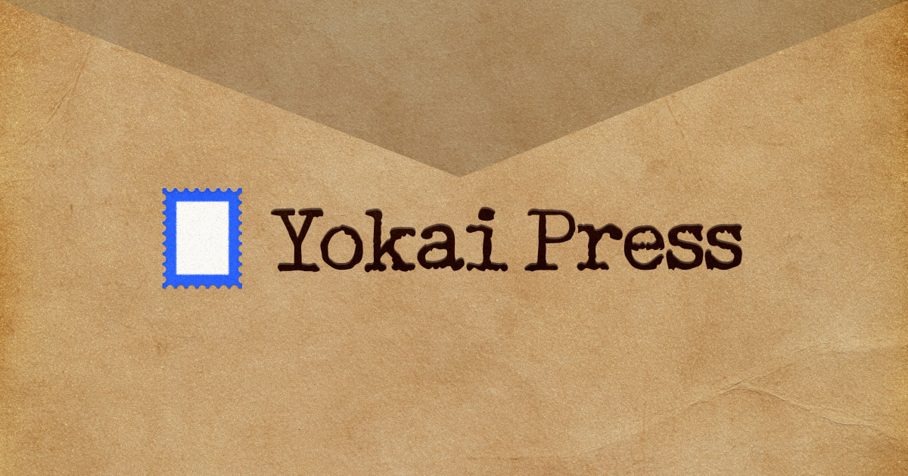

# Yokai Press

A free postage stamp maker for the browser. Pick a format and perforation,
choose the stock, set the content and typography, then export a PNG.

```bash
npm install
npm run dev      # http://localhost:3000
```

## How it renders

The stamp is **one inline SVG**, not a stack of DOM elements. That single source
drives the preview and the PNG export, which is the same SVG rasterised onto a
canvas, so what you see is what comes out of the file.

### Materials

Every stock is a stack of layers over a base colour, never a single gradient:

| Layer | How it is made |
| --- | --- |
| Base | a flat fill under everything |
| Texture | `feTurbulence` run through `feDiffuseLighting`, so the grain has real relief rather than being a printed picture of grain |
| Blend | each layer composited with `multiply`, `overlay` or `soft-light` |
| Sheen | a directional gradient in `soft-light` on top |

Eight stocks ship. Paper, retro and kraft share one combined surface filter that
mixes fine tooth, long fibre and slow sheet undulation into a single height
field and lights it once, which is both cheaper and more coherent than stacking
three separately lit passes. Leather is one lit pass over coarse pores and fine
grain. Denim crosses a warp and a weft relief, then adds vertical slub over a
twill pattern. Holographic tiles the spectrum across the sheet, darkens the
troughs and rides a specular band.

Grain is content aware. Relief layers are multiplied in, which only ever
darkens, so on black stock they would be invisible. Below roughly 0.2 luminance
the same height field is screened in instead, on a ramp so nothing pops as the
colour is dragged darker.

Denim and leather carry a stitched border built from individually jittered
segments. Each stitch is four passes (pressed seam, contact shadow, thread body,
highlight) because a thread is a round cord lying on a surface, not a line.

### Artwork

With no upload the plate falls back to a generated engraving: a ruled sky whose
line weight tapers to the horizon, so tone is built from line rather than from a
gradient fill; aurora curtains cut as reserved striations; a hatched back range
against a solid front range; and a broken dash screen on the water. Line weights
come from a fixed set of four, the way an engraver works from a few burins.

### Print texture

Ink is screened through a halftone dot or an engraver's ruling, drawn in the
stock's own colour so it works on dark stock as well as light. The screen is
painted over the picture but under the rules and lettering, because a press
screens the image plate, not the text plate. Type gets a gentle turbulence
displacement and a second pass offset a hair off register, which is the misprint
that says a press was involved.

### Perforation

`lib/perforation.ts` walks the outline clockwise and cuts each hole with an arc,
so every bite lands inside the sheet. Two things define the look, and both come
from how a real comb works.

The holes are round. A punch is a cylinder, so it makes a circle, and the circle
is the same on all four edges. Driving the bite deeper than it is wide gives an
oval, which reads as a decorative scallop rather than a perforation.

The corners are square, with a full land at each one. A comb runs an edge and
stops, so the sheet separates along two straight lines meeting at a right angle
and the corner is the one place with no hole in it. That corner block is most of
what makes a stamp read as a stamp.

Gauge and hole radius are separate controls. Tooth size and placement carry a
small seeded jitter, because a perforating comb is not a grid.

### Ageing

One control, four signals, because "old" is not "faded": the sheet yellows, damp
paper blooms into foxing, handling grime works in from the edges, and ink lifts
off in flecks. All of it sits over the printing rather than under it, since a
stamp ages after it is printed.

### Layout

One rule decides where the artwork sits and where every line lands, so changing
the arrangement (caption below, caption above, full bleed overlay, or a side
column) moves the picture along with the type. Turning lettering off hands the
whole printed area to the artwork. Every line is fitted to the column it lives
in, so a long country name or a narrow side column cannot run off the plate.

The same layout function feeds the crop control, so the preview frames the
picture against the exact rectangle the artwork will occupy. Two implementations
of that arithmetic would drift apart.

### Paper physics

A `requestAnimationFrame` loop driven entirely by cursor proximity. A stamp
lying on a desk does not move on its own, so every term is scaled by how close
the pointer is, and the plate is completely still until you approach it. That
proximity value is eased rather than applied raw, which gives the weight of
something being disturbed instead of a snap to attention.

The rotation is a 3D transform on purpose. The plate is a heavily filtered SVG,
and under a 3D transform Chrome promotes it to a composited layer and moves it
as a texture. The same motion written as a 2D transform drops out of that path
and re-runs every filter each frame, measured at 25fps against 60.

The shadow is cast by the perforated outline, not by the artwork, so it lives on
its own static SVG layer behind the sheet and is rasterised once. A drop shadow
filter on the plate itself is re-evaluated every frame.

No physics library, no canvas simulation, and it respects
`prefers-reduced-motion`.

## Project layout

```
app/                page shell, global styles, icon and OG image
components/
  stamp/            the SVG renderer: defs (materials, filters), engraving,
                    postmark, and the assembly in StampArt.tsx
  Toolbar.tsx       tab rail and property panel (Lenis scrolled)
  Stage.tsx         the desk, drift wrapper, presentation transforms
  ui.tsx            control primitives
hooks/              usePaperDrift
lib/                geometry, colour, measurement, presets, export
public/fonts/       self-hosted woff2, inlined into exports
```

## Notes on the build

- **Lenis** scrolls the property panel.
- The UI is built to a Paper design file: light and dark themes, the floating
  panel, the six tab bar, and the mobile bottom sheet. The CSS token layer at
  the top of `app/globals.css` mirrors that file's tokens, so a value can be
  traced from the design to the app without a translation step.
- Motion is hand rolled CSS; no animation runtime is installed. Three curves do
  all the work: one that settles, one that overshoots slightly, and one rounder
  bounce for slider handles.
- Twelve display faces and eight label faces, self hosted. The two the current
  stamp uses are inlined into every export so the file travels with its type.

## Shortcuts

- `P` toggles paper physics
- `Cmd/Ctrl + E` exports

## Performance notes

- The plate is drawn on the client only. It is laid out from measured glyph
  widths, which the server cannot do, and keeping a large SVG out of the server
  HTML removes it from hydration as well.
- Only the two faces the current stamp uses are loaded and measured. Waiting on
  `document.fonts.ready` would block on all fifteen.
- Nothing in the artwork reads the pointer, so a frame of drift costs no React
  work. The tilt is written straight to the node's style.
- Sliders and colour inputs coalesce to one config update per frame. A pointer
  reports far above the refresh rate, and every report re-renders the plate.
- Idle sits at 60fps on all eight materials, including while the sheet is
  reacting to the cursor.

## Deploying

Set `NEXT_PUBLIC_SITE_URL` to the public origin. Without it the social card
metadata resolves against localhost and the preview image will not load. Vercel
is handled automatically through `VERCEL_URL`.
